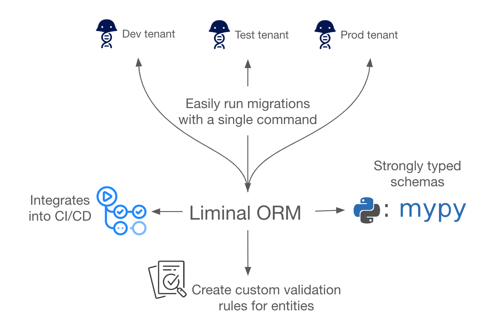

# Liminal ORM

## Overview

Liminal ORM1 is an open-source Python package that builds on [Benchling's](https://www.benchling.com/) LIMS2 platform and provides a simple, code-first approach for synchronizing and managing your Benchling schemas. Join our [**Slack community here**](https://join.slack.com/t/liminalorm/shared_invite/zt-2ujrp07s3-bctook4e~cAjn1LgOLVY~Q)!

Liminal provides an ORM framework using [SQLAlchemy](https://github.com/sqlalchemy/sqlalchemy) along with a schema migration service inspired by [Alembic](https://alembic.sqlalchemy.org/en/latest/). This allows you to define your Benchling schemas in code and create a *single source of truth* that synchronizes between your upstream Benchling tenant(s) and downstream dependencies. By creating a standard interface and through using one-line CLI3 commands, Liminal enables a code-first approach for managing Benchling tenants and accessing Benchling data. With the schemas defined in code, you can also take advantage of the additional capabilities that the Liminal toolkit provides. This includes:

- The ability to run migrations to your Benchling tenant(s) through an easy to use CLI.
- One source of truth defined in code for your Benchling schema model that your many Benchling tenants can stay in sync with.
- Easy to implement validation rules to reflect business logic for all of your Benchling entities.
- Strongly typed queries for all your Benchling entities.
- CI/CD integration with GitHub Actions to ensure that your Benchling schemas and code are always in sync.
- And more based on community contributions/feedback :)

Benchling is an industry standard cloud platform for life sciences R&D. Liminal builds on top of Benchling's platform and assumes that you already have a Benchling tenant set up and have (or have access to) an admin user account. If not, learn more about getting started with Benchling [here](https://www.benchling.com/explore-benchling)!

If you are a Benchling user, try out Liminal by following the [quickstart guide](./getting-started/prerequisites.md)! Reach out in the [Discussions](https://github.com/dynotx/liminal-orm/discussions) forum with any questions or to simply introduce yourself! If there is something blocking you from using Liminal or you're having trouble setting Liminal up, please share in [Issues](https://github.com/dynotx/liminal-orm/issues) or reach out directly (contact information below). You can expect responses within 48 hours :)

Nirmit Damania is the creator and current maintainer of Liminal (I post Liminal updates to [Discussions](https://github.com/dynotx/liminal-orm/discussions) and my [LinkedIn](https://www.linkedin.com/in/nirmit-damania/)). Most importantly, **you** have the ability to influence the future of Liminal! Any feedback, positive or negative, is highly encouraged and will be used to steer the direction of Liminal. Refer to the [Contributing guide](https://github.com/dynotx/liminal-orm/blob/main/CONTRIBUTING.md) to learn more about how you can contribute to Liminal.

⭐️ Leave a star on the repo to spread the word!
If you or your organization use Liminal, please consider adding yourself or your organization to the [Users](https://github.com/dynotx/liminal-orm/blob/main/USERS.md) list.

    

## Mission

The democratization of software in Biotech is crucial. By building a community around complex, yet common, problems and creating open-source solutions, we can work together to tackle these challenges together and enable faster innovation in the industry. By breaking down the silos between private platforms, we can enable a more dynamic and open ecosystem. This was the motivation for Liminal's creation. Liminal's goal is to create an open-source software product that enables a standard, code-first approach to configuration and change management for LIMS systems. We started with Benchling, but the goal is to make Liminal the go-to solution for any LIMS system.

## Direct contact information

- Liminal Community Slack group: [Join here](https://join.slack.com/t/liminalorm/shared_invite/zt-2ujrp07s3-bctook4e~cAjn1LgOLVY~Q)
- Email: <opensource@dynotx.com>
- LinkedIn: [Nirmit Damania](https://www.linkedin.com/in/nirmit-damania/)

## Footnotes

ORM1: Object-Relational Mapper. An ORM is a piece of software designed to translate between the data representations used by databases and those used in object-oriented programming. In this case, Liminal provides an ORM layer built specifically for Benchling that allows for users to quickly and easily define Benchling entities in code. [SQLAlchemy](https://github.com/sqlalchemy/sqlalchemy) is the underlying ORM that Liminal uses to interact with your Benchling tenant(s) and is an open-source software that is an industry standard software.

LIMS2: Laboratory Information Management System. A LIMS is a piece of software that allows you to effectively manage samples and associated data. [Benchling](https://www.benchling.com/) is an industry-leading LIMS software.

CLI3: Command Line Interface. A CLI is a piece of software that allows you to interact with a software program via the command line. Liminal provides a CLI that allows you to interact with your Liminal environment. This project uses [Typer](https://github.com/fastapi/typer) to construct the CLI
